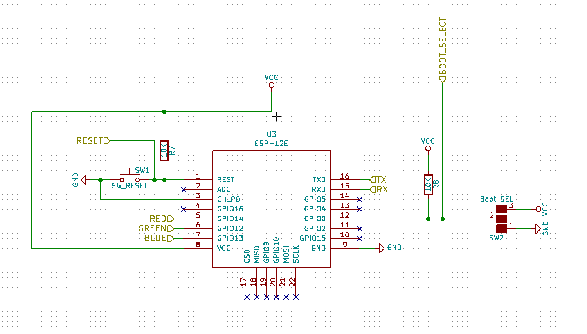
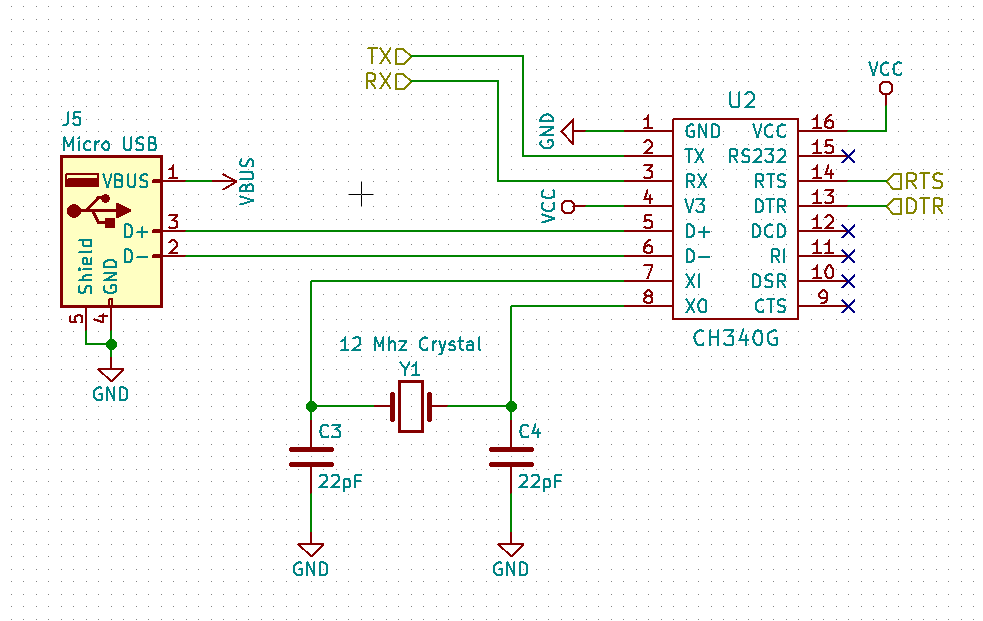
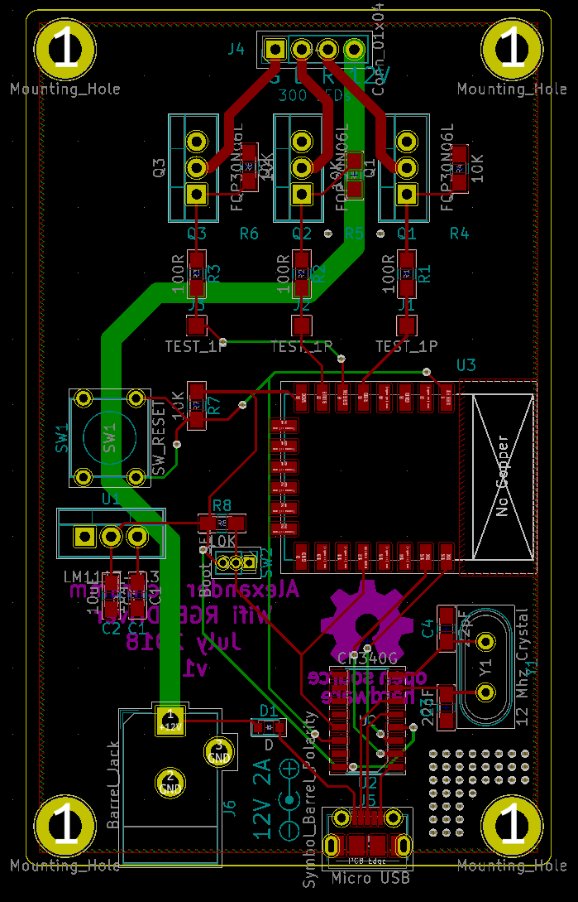
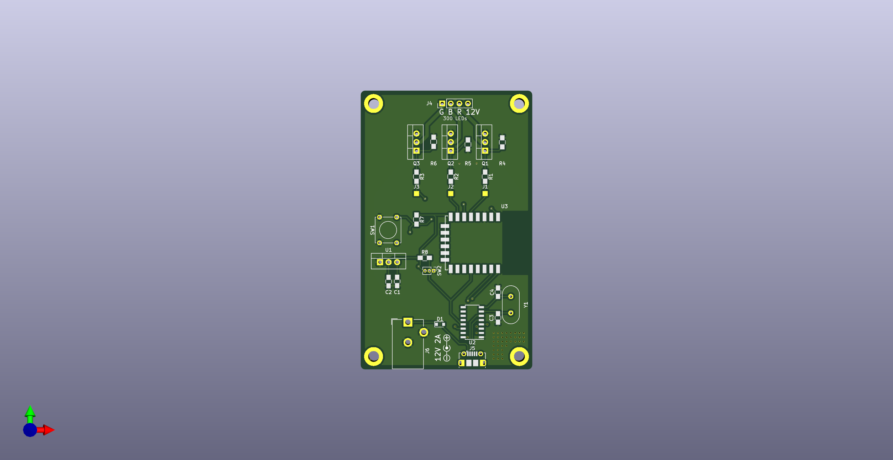

# LedBlinks
LedBlinks is a wifi configurable controller/driver for up to 3 independent channels. It can be used to control RGB LED strips over wifi. But you can control any other load, for example three independent white led strips or just 3 single leds.

